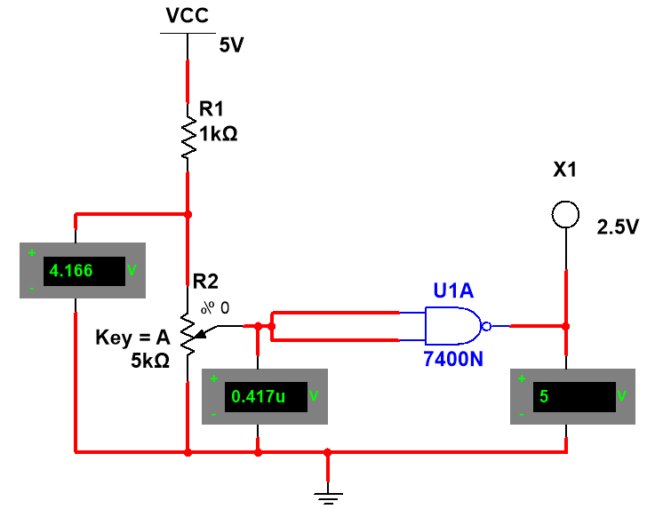
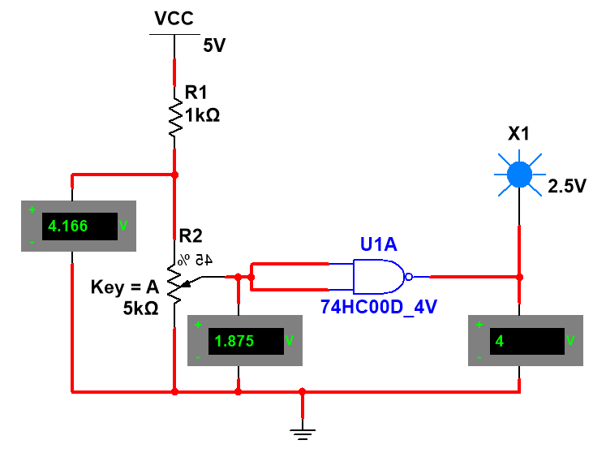
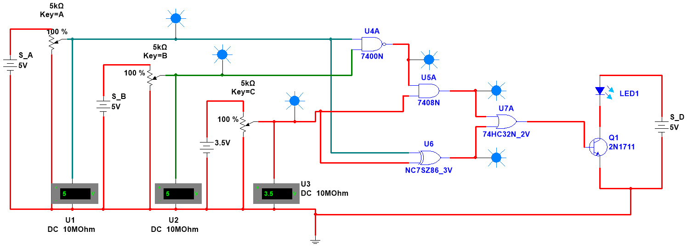
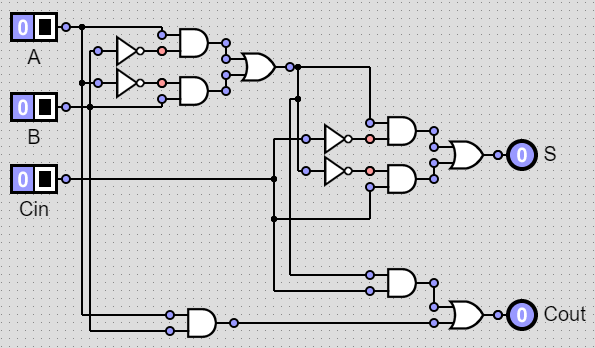
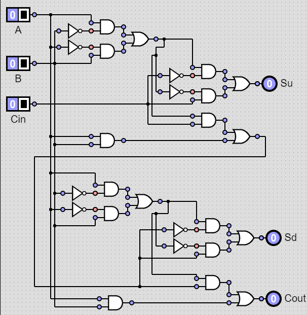
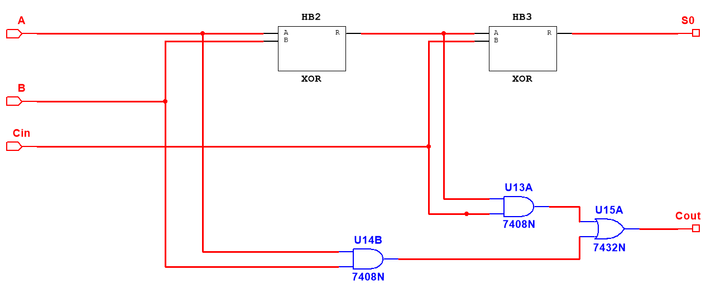
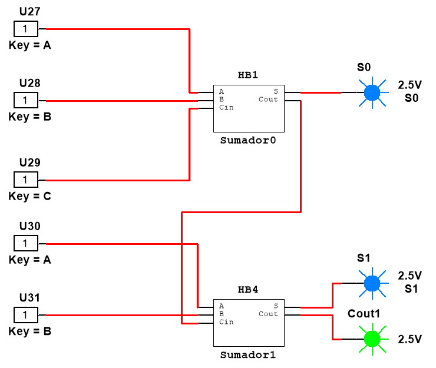
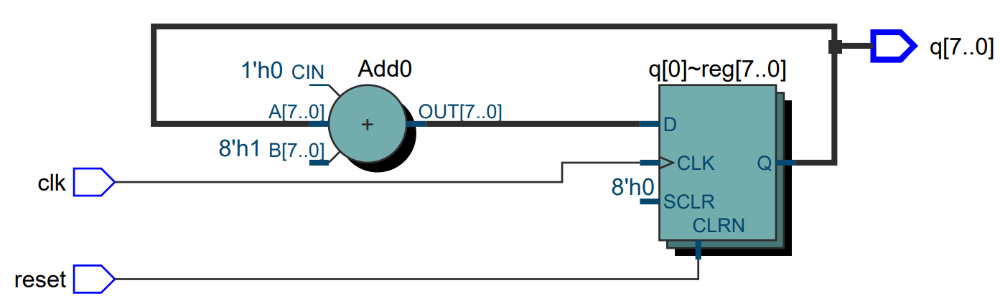

# TallerDigitales :computer:

En este git se almacenarán los Laboratorios, las Tareas y el Proyecto correspondientes al curso de Taller de Diseño de Sistemas Digitales.

## Laboratorio #1 :floppy_disk:
Este laboratorio introduce al estudiante al uso de chips de compuertas lógicas, así como de herramientas y dispositivos relacionados con uso. Se dará especial énfasis al comportamiento y a las características eléctricas de algunas familias de compuertas lógicas. En este laboratorio será necesario un software que permita la simulación de componentes digitales y analógicos discretos (LTSpice, NI MultiSim, Proteus, etc).

### Experimento #1: 
Realizar mediciones con circuitos TTL y CMOS.

TTL                             | CMOS                              |
:-------------------------:     |:-------------------------:        |
 |   |

### Experimento #2:
Proponer un circuito que modele la función F = ((A ~& B) & C) + (A ^ C).
Para esto de debe desarrollar una interfaz entre las tecnologías TTL y CMOS, pero dato que los dispositivos utilizados no necesitanq ue se desarrolle una interfaz entre los mismos se tiene.

Interfaz TTL - CMOS                         |
:-------------------------:                 |
    |
### Experimento #3:
A partir de compuertas lógicas y partiendo de un sumador completo de 1 bit, desarrollar un sumador completo de 2 bits.

Sumador 1 bit                               | Sumador 2 bits
:-------------------------:                 |:-------------------------:|
              |

Desarrollados en MultiSim se tiene lo siguiente.

Sumador 1 bit                               | Sumador 2 bits
:-------------------------:                 |:-------------------------:|
   |
## Laboratorio #2 :floppy_disk:
Este laboratorio introduce al estudiante al dise˜no de circuitos digitales por medio de lenguajes de descripción de hardware (HDL). Un HDL es una forma de describir la especificación, comportamiento o estructura de un módulo de hardware, por medio de una estructura pro-gramática. Pese a su similitud con un lenguaje de programación (tipos de datos, estructuras básicas, sintaxis, etc) los HDL deben describir hardware, por lo que para todo dise˜no, se debe tener conocimiento completo de qué componente se están dise˜nando. Esto implica la realización previa de tablas de verdad, diagramas de estados, diagramas de bloques, etc.

### Experimento #1:
Este experimento consiste en dise˜nar un decodificador para display 7 segmentos con un modelo de comportamiento en SystemVerilog, para el código ASCII (0-9, A-Z), en caso de que la letra no se pueda representar, deberá representar con la letra E.

Decodificador ASCCI 7 Segmentos             |
:-------------------------:                 |
      |
### Experimento #2: 
Este experimento consiste en dise˜nar un sumador completo de 6 bits con modelo de estructura en VHDL, partiendo del dise˜no un sumador completo de 1 bit.

Sumador Completo de 6 bits                  |
:-------------------------:                 |
      |
### Experimento #3: 
Este experimento consiste en dise˜nar contador parametrizable de N bits con reset asincrónico en el lenguaje de descripción de su preferencia, se utilizó System Verilog.
El modelo de bloques queda definido de la siguiente manera.

Contador Parametrizable de N bits           |
:-------------------------:                 |
      |
## Laboraotorio #3 :floppy_disk:
Un circuito combinacional es aquel en que las salidas solamente dependen combinaciones de la entradas y no del tiempo. Esta característica hace que los sistemas combinacionales sean en general rápidos, ya que no requieren ningún tipo de sincronización con se˜nales de reloj. En sistemas digitales complejos, como los microprocesadores, los circuitos de lógica combinacional juegan un papel fundamental. Es por esto que en este laboratorio se realizará el dise˜no de una Unidad Lógico-Aritmética (ALU), componente esencial en la etapas de ejecución de cualquier microprocesador moderno. La ALU es la unidad encargada de la ejecución de las instrucciones aritméticas y lógicas en un procesador. Dichas instrucciones requieren tiempos de ejecución cortos, para tener máximo desempe˜no en el procesador y es por esta razón por la que en general se requiere de una lógica combinacional en su implementación. En este laboratorio el estudiante aplicará los conceptos de lógica combinacional en el dise˜no de circuitos digitales lógicos y aritméticos con un lenguaje de descripción de hardware. Además, se abordarán asuntos de tiempo relacionados con lógica combinacional, como lo son los tiempos de propagación y contaminación así como la ruta crítica.

### Experimento #1: 
Se debe realizar una calculadora parametrizable, con el fin de que pueda ejecutar las operaciones de suma, resta, multiplicación, división, módulo, and, or, xor, shiftL, shifR. Se debe de implementar las banderas de estados de la ALU: Negativo (N), Cero (Z), Acarreo (C) y Desbordamiento (V).

ALU (Interior)                              | ALU (conectada)
:-------------------------:                 |:-------------------------:|
           | 

### Experimento #2: 
## Laboratorio #4 :tv:
Un circuito secuencial es aquel en que las salidas dependen tanto de las combinaciones de la entradas y del tiempo. Esta característica hace que los sistemas secuenciales sean poderosos en tareas que involucran tiempo, a la vez que representan un mayor grado de complejidad que los combinacionales. En sistemas digitales complejos, como los microprocesadores y controladores de dispositivos externos, los circuitos de lógica secuencial juegan un papel fundamental. La lógica secuencial, al tomar el cuenta el tiempo, ha sido utilizada además para la creación de controladores de diferentes dispositivos en los computadores modernos. Cada componente de hardware que  se anexa a un computador tiene su protocolo para configuración y uso. Uno de los dispositivos más comunes anexados a un computador es el dispositivo de visualización, como es el caso de un monitor. Existen diferentes tecnologías y protocolos de configuración de monitores. Para este laboratorio se trabajará con monitores que trabajan con una interfaz VGA (Video Graphics Array) en un resolución de 640x480 pixeles. En este laboratorio se aplicarán los conceptos de dise˜no digital secuencial, en el dise˜no de una aplicación manejada por una máquina de estados finitos, así como un controlador para un monitor VGA, que eventualmente podría ser usado por un computador para la visualización de información. Adicionalmente, se implementará una aplicación.

#### Controlador VGA
Para el dise˜no del controlador VGA debe realizar un modelo de estructura, en SystemVerilog, que incluya los subcomponentes del mismo. Tome en cuenta la naturaleza de las se˜nales, así como el diagrama de tiempos investigado en la sección anterior. El controlador deberá manejar las se˜nales de sincronización, así como las se˜nales de color por pixel (8 bits por canal, por pixel), que serán generadas tomando en cuenta el controlador principal de la aplicación. El controlador deberá dise˜narse para una resolución de 640x80 pixeles.

#### Tic-Tac-Toe
La aplicación a implementar será un juego de tic-tac-toe (gato) para dos jugadores. Al iniciar, la aplicación principal se deberá separar la pantalla en 9 secciones de igual tama˜no. El primer jugador podrá desplazarse por las secciones utilizando los botones de la FPGA. Cuando el jugador lo desee, podrá seleccionar una de las secciones por medio de un botón. Al realizarlo, deberá mostrarse una figura (x,o, o cualquier otra) sobre esa casilla, marcando la jugada. Si el jugador no hace su movida en 30 segundos, el sistema le asignará una posición al azar, sobre las restantes. Luego, siguiendo la lógica del juego, el segundo jugador hará su movida de la misma forma. La figura que representa al segundo jugador deberá ser diferente al primero. El juego deberá continuar hasta que un jugador logre una línea (vertical, horizontal o diagonal) de 3 de sus figuras representativas, o hasta que no queden casillas libres. Al finalizar el juego deberá mostrarse en pantalla el jugador ganador, así como resaltarse la jugada ganadora (línea).

Los controles de la misma son:

```shell
    Key0: buscar la casilla donde se desea realizar la jugada
    Key1: seleccionar la casilla y jugar
    Key2: realizar un reset al juego
```
## Proyecto :computer:
La finalidad de este proyecto final es que el estudiante aplique los conocimientos adquiridos del dise˜no de sistemas digitales, en estructuras avanzadas, que involucran sincronización y la "interacción" con elementos de entrada-salida y memoria, así como elementos de procesamiento, propios de un computador. Para ello, cada grupo de estudiantes deberá dise˜nar e implementar, mediante el lenguaje de descripción de hardware SystemVerilog, un computador mínimo, basado en un microprocesador con arquitectura ARM. Este proyecto reforzará la metodología de dise˜no modular, utilizada en los diferentes laboratorios, de manera que implica investigación, planeamiento del dise˜no, descripción del hardware, implementación y verificación funcional respectiva.

#### Aplicación
Este proyecto final deberá solucionar el siguiente problema, utilizando un procesador ARMv4. El sistema deberá contar con una memoria ROM en la que se precargarán los caracteres (Frases). Estos caracteres estarán en código ASCII de (0-255), con el fin de que sean procesados. Estos caracteres podrán ser tomados de cualquier manera. Cabe resaltar que el texto introducido está cifrado y para descifrarlo se utilizará alguno de los tres algoritmos que se detallan más adelante. La función del procesador será aplicar el filtro, que el usuario elija por medio de los switches, a los caracteres precargados en memoria. Los nuevos caracteres descifrados serán almacenados en memoria para su posterior despliegue en un monitor (Controlador VGA). Cabe resaltar que el procesamiento de descifrado inicia cuando el usuario presiona alguno de los botones.

#### Filtrado de Texto
El filtrado del texto se realizar´a con alguno alguno de los siguientes algoritmos.

- XOR: A cada caracter se le aplica la operación XOR con el número representado por los switches (los primeros tres).
- NOT: A cada caracter se le debe realizar la operación NOT (bitwise).
- Suma: A cada caracter se le suma 2.
